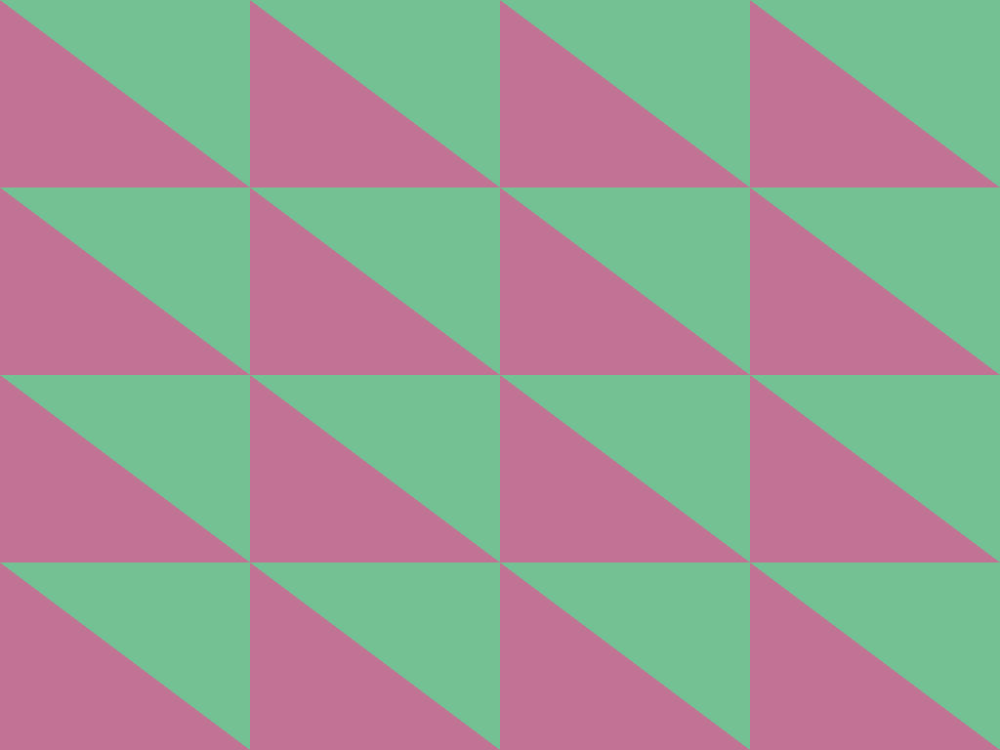

This is a link to our 30 second demo on youtube. This demonstrates AI versus AI. There is also a game mode for humans. 

https://www.youtube.com/watch?v=7y1m0Ol24jI

This is what our game board looks like in openGL. Although we color in the triangles in black and white to form the game board. 

Keeping it consistent, to draw each checker piece required the following. 

The result of the triangles from the checker pieces and checker board is this. 

